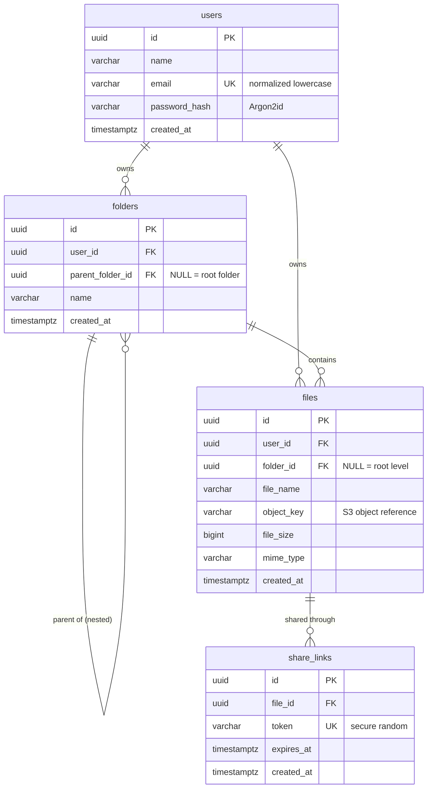

# CloudVault — Database Design

PostgreSQL is the metadata store. **File contents never enter PostgreSQL** —
binary data lives in object storage (AWS S3), referenced by
`files.object_key`.

- Runtime code: `backend/app/database/` (models, session management)
- Schema lifecycle: `database/migrations/` (Alembic)
- Seeds: `database/seeds/`

---

## 1. Entity–Relationship Diagram



---

## 2. Tables

### 2.1 `users`

| Column          | Type          | Null | Default | Notes                                   |
|-----------------|---------------|------|---------|-----------------------------------------|
| `id`            | `UUID`        | no   | gen (app) | Primary key (`uuid4`, generated client-side) |
| `name`          | `VARCHAR(255)`| no   | —       | Display name                            |
| `email`         | `VARCHAR(320)`| no   | —       | **Unique**, always stored normalized (lowercase, trimmed) |
| `password_hash` | `VARCHAR(255)`| no   | —       | Argon2id hash — never plaintext         |
| `created_at`    | `TIMESTAMPTZ` | no   | `now()` | Timezone-aware UTC                      |

Constraints & indexes:

- `pk_users` — primary key (`id`)
- `uq_users_email` / `ix_users_email` — **unique index** on `email` (also makes login lookups efficient)
- `ck_users_email_lowercase` — `CHECK (email = lower(email))` enforces the normalization invariant at the database level

### 2.2 `folders`

| Column             | Type          | Null | Notes                            |
|--------------------|---------------|------|----------------------------------|
| `id`               | `UUID`        | no   | Primary key                      |
| `user_id`          | `UUID`        | no   | FK → `users.id` `ON DELETE CASCADE` |
| `parent_folder_id` | `UUID`        | yes  | `NULL` = root-level folder       |
| `name`             | `VARCHAR(255)`| no   |                                  |
| `created_at`       | `TIMESTAMPTZ` | no   | Server default `now()`           |

Constraints & indexes:

- `pk_folders` — primary key
- `fk_folders_user_id_users` — ownership FK, cascade on user deletion
- `ix_folders_user_id`, `ix_folders_parent_folder_id` — lookup indexes
- `uq_folders_user_id_id` — `UNIQUE (user_id, id)`; exists as the target of the composite FK below
- `fk_folders_user_id_parent_folder_id_folders` — **composite FK `(user_id, parent_folder_id) → folders(user_id, id)`**: a parent folder *must* belong to the same user. This makes cross-user parent references impossible at the database level, in addition to service-level validation.
- `ck_folders_no_self_parent` — `CHECK (parent_folder_id IS NULL OR parent_folder_id <> id)`

### 2.3 `files` (metadata only — shared with Member 1)

| Column       | Type           | Null | Notes                               |
|--------------|----------------|------|-------------------------------------|
| `id`         | `UUID`         | no   | Primary key                         |
| `user_id`    | `UUID`         | no   | FK → `users.id` `ON DELETE CASCADE` |
| `folder_id`  | `UUID`         | yes  | FK → `folders.id` `ON DELETE CASCADE`; `NULL` = root level |
| `file_name`  | `VARCHAR(255)` | no   | Original/display name               |
| `object_key` | `VARCHAR(1024)`| no   | Object-storage key (e.g. `users/{user_id}/folders/{folder_id}/{name}`) |
| `file_size`  | `BIGINT`       | no   | Bytes                               |
| `mime_type`  | `VARCHAR(255)` | no   |                                     |
| `created_at` | `TIMESTAMPTZ`  | no   | Server default `now()`              |

Constraints & indexes:

- `ix_files_user_id`, `ix_files_folder_id` — ownership/listing indexes
- `ck_files_file_size_non_negative` — `CHECK (file_size >= 0)`

### 2.4 `share_links`

| Column       | Type          | Null | Notes                                |
|--------------|---------------|------|--------------------------------------|
| `id`         | `UUID`        | no   | Primary key                          |
| `file_id`    | `UUID`        | no   | FK → `files.id` `ON DELETE CASCADE`  |
| `token`      | `VARCHAR(64)` | no   | `secrets.token_urlsafe(32)` (43 chars, 256 bits) |
| `expires_at` | `TIMESTAMPTZ` | no   | Authoritative expiry — checked server-side on every access |
| `created_at` | `TIMESTAMPTZ` | no   | Server default `now()`               |

Constraints & indexes:

- `ix_share_links_token` — **unique index** on `token` (efficient + unique lookups)
- `ix_share_links_file_id` — reverse-lookup index

---

## 3. Deletion Behavior (cascade design)

| Action             | Database effect                                                                 |
|--------------------|---------------------------------------------------------------------------------|
| Delete a **user**  | All their folders, files and share links are cascade-deleted                     |
| Delete a **folder**| Its subfolders, the metadata of contained files, and those files' share links are cascade-deleted |
| Delete a **file**  | Its share links are cascade-deleted — **stale share links can never exist**       |

Rationale:

- `share_links.file_id → files.id ON DELETE CASCADE` guarantees a deleted file
  can never stay publicly accessible through an old link (requirement FR-07/FR-11).
- Folder → file cascade mirrors Google-Drive-style "delete folder deletes
  contents" semantics and keeps metadata consistent.
- ⚠️ **Important for Member 1**: because folder/file deletion cascades in the
  database, the file service must enumerate and remove the S3 objects of all
  affected files **before** deleting the database rows, otherwise orphaned
  S3 objects remain (see FR-07).

---

## 4. Key Invariants

1. Emails are unique and normalized (`lower(email) = email` enforced by CHECK).
2. Passwords are only ever stored as Argon2id hashes.
3. A folder's parent (if any) always belongs to the same owner (composite FK).
4. A share link always references an existing file (FK; cascade on delete).
5. Share tokens are unique, random and URL-safe (unique index + `secrets`).
6. All timestamps are `TIMESTAMPTZ` and compared as timezone-aware UTC values.

---

## 5. Migrations

Alembic configuration lives in `database/migrations/` and reads the same
`DATABASE_URL` as the application (environment variable first, then the app
settings/`.env`).

Initialize a clean database:

```bash
# from the repository root, with PostgreSQL running and .env configured
cd database/migrations
alembic upgrade head
```

Other commands:

```bash
alembic downgrade base        # remove all tables
alembic current               # show applied revision
alembic history               # list revisions
alembic revision --autogenerate -m "describe change"   # after editing models
```

The initial migration `46d1a57b07cf` creates `users`, `folders`, `files` and
`share_links` with all primary keys, foreign keys, unique constraints, check
constraints, indexes and timestamps. A clean database can be initialized
entirely from migrations — verified automatically by the test suite
(`backend/tests/test_migrations.py`).

---

## 6. Local PostgreSQL

Fastest path (Docker):

```bash
docker compose up -d postgres
```

See `docker-compose.yml` — it starts PostgreSQL 16 with the database and the
`cloudvault_test` test database pre-created, using the same credentials as
`.env.example`.

---

## 7. Seeding demo data

```bash
# from the repository root
python database/seeds/seed.py     # or: bash scripts/seed.sh
```

Creates two demo users (hashed passwords), nested folders, file metadata and
one valid + one expired share link. Development only — the script refuses to
run when `APP_ENV=production`.
